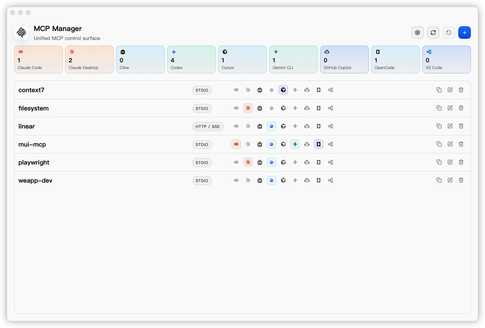

<p align="center">
  
</p>

<h1 align="center">MCP Manager</h1>

<p align="center">
  A cross-platform desktop app for managing MCP server configs across Claude Code, Codex, Cursor, VS Code, OpenCode, Gemini CLI, and more.
</p>

<p align="center">
  <a href="./LICENSE"></a>
  
  
  
  
</p>

<p align="center">
  English | <a href="./README.zh-CN.md">简体中文</a> | <a href="https://github.com/xjeway/mcp-manager/releases/latest">Latest Release</a> | <a href="./docs/releasing.md">Release Guide</a>
</p>

## Why MCP Manager

`MCP Manager` is a cross-platform desktop app for people who do not want to hand-edit multiple MCP client configs.

- Keep a unified MCP workspace for all configured servers
- Import existing entries from local client configuration
- Edit servers in form mode or raw JSON mode
- Apply generated configuration to multiple supported clients
- Review risky writes before files change
- Keep backups and rollback support during apply
- Use light mode, dark mode, or system theme
- Work in English or Simplified Chinese

## Screenshots



## Download & Installation

### System Requirements

- Desktop packages are published for macOS, Windows, and Linux
- Building from source requires Node.js 20+, npm 10+, Rust stable, and Tauri system dependencies for your platform

### macOS

#### Homebrew

```bash
# Coming soon
brew tap xjeway/tap
brew install --cask mcp-manager
brew update
brew upgrade --cask mcp-manager
```

#### Manual Download

Download from:

- <https://github.com/xjeway/mcp-manager/releases/latest>

Example macOS asset names:

- `MCP-Manager-<version>-<arch>.dmg`

Arch guide:

- Apple Silicon Macs: choose `arm64` or `aarch64` assets
- Intel Macs: choose `x64` or `x86_64` assets

After downloading the correct macOS asset, open it locally:

```bash
open ~/Downloads/MCP-Manager*.dmg
```

Current public macOS releases may still be unsigned while Apple signing and notarization are being prepared. If Gatekeeper blocks `MCP Manager.app`, use this fallback flow:

1. Drag `MCP Manager.app` into `/Applications`.
2. In Finder, right-click the app once and choose `Open`.
3. If macOS still says the app cannot be opened or is damaged, remove the quarantine flag and try again:

```bash
xattr -dr com.apple.quarantine "/Applications/MCP Manager.app"
open "/Applications/MCP Manager.app"
```

### Windows

#### Manual Download

Download from:

- <https://github.com/xjeway/mcp-manager/releases/latest>

Example Windows asset names:

- `MCP-Manager-<version>-<arch>-setup.exe`
- `MCP-Manager-<version>-x64.msi`

Arch guide:

- Windows on ARM devices: choose the `arm64` installer asset
- Intel / AMD PCs: choose the `x64` or `x86_64` installer asset

Package guide:

- `setup.exe`: available for both Windows x64 and Windows arm64
- `.msi`: published for stable Windows x64 releases

Choose the asset that matches your arch, then run it locally:

```powershell
Start-Process "C:\Path\To\MCP-Manager-Setup.exe"
# or
msiexec /i "C:\Path\To\MCP-Manager.msi"
```

### Linux Users

Download the latest Linux build from the [Releases](https://github.com/xjeway/mcp-manager/releases/latest) page:

Example Linux asset names:

- `mcp-manager_<version>_<arch>.deb` (Debian/Ubuntu)
- `mcp-manager-<version>.<arch>.rpm` (Fedora/RHEL/openSUSE)
- `MCP-Manager-<version>-<arch>.AppImage` (Universal)

Expanded distro guide:

- `.deb`: Debian, Ubuntu, Linux Mint, Pop!_OS, elementary OS, and other Debian-based distributions
- `.rpm`: Fedora, RHEL, Rocky Linux, AlmaLinux, openSUSE, and other RPM-based distributions
- `.AppImage`: portable option for desktop Linux when you do not want a system package

Arch guide:

- `x86_64` or `amd64` for most Intel and AMD 64-bit PCs
- `arm64` or `aarch64` for ARM64 Linux devices, when that asset is published in the release

Install with the matching command:

```bash
# Debian / Ubuntu
sudo dpkg -i ./mcp-manager_<version>_amd64.deb

# Fedora / RHEL / openSUSE
sudo rpm -i ./mcp-manager-<version>.x86_64.rpm

# AppImage
chmod +x ./MCP-Manager-<version>.AppImage
./MCP-Manager-<version>.AppImage
```

### Build From Source

Install dependencies:

```bash
make install
```

Run the desktop app:

```bash
make tauri-dev
```

Run the web UI only:

```bash
make dev
```

## Quick Start

1. Launch `MCP Manager`.
2. Import existing entries from local client configuration files.
3. Edit servers in form mode or JSON mode.
4. Apply the generated config to one or more supported clients.
5. Review warnings, then write with backup and rollback protection.

## Supported Clients

### Available Now

| Client | Import | Apply |
| --- | --- | --- |
| Claude Code | ✅ | ✅ |
| Claude Desktop | ✅ | ✅ |
| Codex | ✅ | ✅ |
| Cursor | ✅ | ✅ |
| OpenCode | ✅ | ✅ |
| GitHub Copilot | ✅ | ✅ |
| Gemini CLI | ✅ | ✅ |
| Antigravity | ✅ | ✅ |
| iFlow | ✅ | ✅ |
| Qwen Code | ✅ | ✅ |
| Cline | ✅ | ✅ |
| Windsurf | ✅ | ✅ |
| Kiro | ✅ | ✅ |
| VS Code | ✅ | ✅ |

## How It Works

- The app reads local client configuration and converts it into the internal model
- Apply writes client-specific output with atomic updates, backup, and rollback support

## Scope

Current scope is focused on configuration management. Runtime lifecycle management such as process start, stop, logs, and health checks is intentionally out of scope for v1.

## Project Structure

```text
mcp-manager/
  src/                frontend application
  src-tauri/          tauri app + rust backend
  public/             static assets and branding
  docs/               release notes and design references
  openspec/           change and spec tracking
```

### Backend Modules

- `platform`: OS-aware path resolution and environment context
- `adapters`: per-client import and apply logic
- `core`: canonical config model and merge behavior
- `parser`: YAML / JSON / TOML parsing and extraction
- `storage`: atomic write, backup, and rollback
- `commands`: Tauri commands exposed to the frontend

## Development

```bash
make install
make dev
make tauri-dev
make build
make test
make check
make tauri-build
```

## Release Automation

This repository includes GitHub Actions workflows for CI and desktop release packaging with the official Tauri release action.

See [`docs/releasing.md`](./docs/releasing.md) for:

- tag-driven GitHub Release publishing
- macOS, Windows, and Linux package generation
- updater signing setup
- optional platform code signing
- version sync and git tag helper commands

## Contributing

Issues and pull requests are welcome.

If you plan to contribute a non-trivial change, open an issue or discussion first so the scope and direction are clear before implementation.

### Local Development

```bash
make install
make tauri-dev
```

### Before Opening a PR

```bash
make test
make check
```

Keep [`README.md`](./README.md) and [`README.zh-CN.md`](./README.zh-CN.md) in sync when changing user-facing project documentation.

## License

MIT @ xJeway
