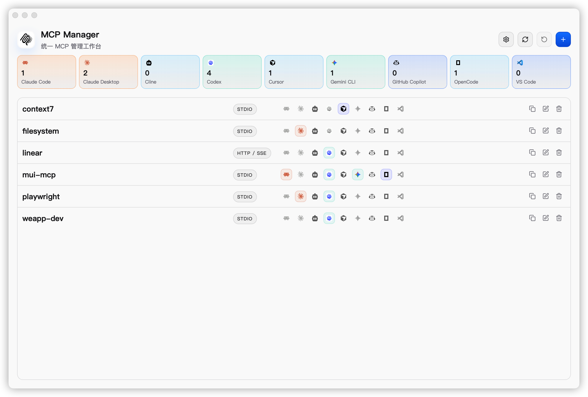

<p align="center">
  
</p>

<h1 align="center">MCP Manager</h1>

<p align="center">
  一个跨平台桌面应用，用于管理 Claude Code、Codex、Cursor、VS Code、OpenCode、Gemini CLI 等客户端的 MCP Server 配置。
</p>

<p align="center">
  <a href="./LICENSE"></a>
  
  
  
  
</p>

<p align="center">
  <a href="./README.md">English</a> | 简体中文 | <a href="https://github.com/xjeway/mcp-manager/releases/latest">Latest Release</a> | <a href="./docs/releasing.md">发布说明</a>
</p>

## 为什么选择 MCP Manager

`MCP Manager` 是一个跨平台桌面应用，适合不想手动维护多份 MCP 客户端配置的用户。

- 统一维护所有 MCP Server 的工作台
- 从本地客户端配置中导入已有条目
- 支持表单模式和原始 JSON 模式编辑
- 向多个受支持客户端生成并应用配置
- 文件写入前展示风险提示
- apply 过程支持备份与回滚
- 支持浅色、深色、跟随系统主题
- 支持英文与简体中文界面

## 界面截图



## 下载与安装

### 系统要求

- 提供 macOS、Windows、Linux 的桌面安装包
- 从源码构建需要 Node.js 20+、npm 10+、Rust stable，以及当前平台所需的 Tauri 系统依赖

### macOS

#### Homebrew

```bash
# 即将支持
brew tap xjeway/tap
brew install --cask mcp-manager
brew update
brew upgrade --cask mcp-manager
```

#### 手动下载

下载地址：

- <https://github.com/xjeway/mcp-manager/releases/latest>

macOS 安装包文件名示例：

- `MCP-Manager-<version>-<arch>.dmg`

Arch 选择说明：

- Apple Silicon Mac：选择 `arm64` 或 `aarch64` 资产
- Intel Mac：选择 `x64` 或 `x86_64` 资产

下载与你的 arch 匹配的 macOS 安装包后，可直接在本地打开：

```bash
open ~/Downloads/MCP-Manager*.dmg
```

### Windows

#### 手动下载

下载地址：

- <https://github.com/xjeway/mcp-manager/releases/latest>

Windows 安装包文件名示例：

- `MCP-Manager-<version>-<arch>-setup.exe`
- `MCP-Manager-<version>-x64.msi`

Arch 选择说明：

- Windows on ARM 设备：选择 `arm64` 安装包
- Intel / AMD PC：选择 `x64` 或 `x86_64` 安装包

安装包说明：

- `setup.exe`：同时提供 Windows x64 和 Windows arm64 版本
- `.msi`：当前提供 Windows x64 版本

选择与你的 arch 匹配的安装包后，在本地运行：

```powershell
Start-Process "C:\Path\To\MCP-Manager-Setup.exe"
# 或
msiexec /i "C:\Path\To\MCP-Manager.msi"
```

### Linux 用户

请从 [Releases](https://github.com/xjeway/mcp-manager/releases/latest) 页面下载最新的 Linux 安装包：

Linux 安装包文件名示例：

- `mcp-manager_<version>_<arch>.deb`（Debian/Ubuntu）
- `mcp-manager-<version>.<arch>.rpm`（Fedora/RHEL/openSUSE）
- `MCP-Manager-<version>-<arch>.AppImage`（Universal）

展开说明：

- `.deb`：适用于 Debian、Ubuntu、Linux Mint、Pop!_OS、elementary OS 等 Debian 系发行版
- `.rpm`：适用于 Fedora、RHEL、Rocky Linux、AlmaLinux、openSUSE 等 RPM 系发行版
- `.AppImage`：适用于可移植、通用的桌面 Linux 版本

Arch 选择说明：

- `x86_64` 或 `amd64`：适用于大多数 Intel / AMD 64 位 PC
- `arm64` 或 `aarch64`：适用于 ARM64 Linux 设备，仅在该架构安装包已发布时选择

按对应命令安装：

```bash
# Debian / Ubuntu
sudo dpkg -i ./mcp-manager_<version>_amd64.deb

# Fedora / RHEL / openSUSE
sudo rpm -i ./mcp-manager-<version>.x86_64.rpm

# AppImage
chmod +x ./MCP-Manager-<version>.AppImage
./MCP-Manager-<version>.AppImage
```

### 从源码构建

安装依赖：

```bash
make install
```

启动桌面应用：

```bash
make tauri-dev
```

仅启动 Web UI：

```bash
make dev
```

## 快速开始

1. 启动 `MCP Manager`。
2. 从本地客户端配置文件导入已有条目。
3. 使用表单模式或 JSON 模式编辑 Server。
4. 将生成后的配置应用到一个或多个目标客户端。
5. 确认风险提示后执行写入，并在需要时回滚。

## 支持的客户端

### 已支持

| 客户端 | 导入 | 应用 |
| --- | --- | --- |
| Claude Code | ✅ | ✅ |
| Claude Desktop | ✅ | ✅ |
| Codex | ✅ | ✅ |
| Cursor | ✅ | ✅ |
| OpenCode | ✅ | ✅ |
| GitHub Copilot | ✅ | ✅ |
| Gemini CLI | ✅ | ✅ |
| Antigravity | ✅ | ✅ |
| iFlow | ✅ | ✅ |
| Qwen Code | ✅ | ✅ |
| Cline | ✅ | ✅ |
| Windsurf | ✅ | ✅ |
| Kiro | ✅ | ✅ |
| VS Code | ✅ | ✅ |

## 工作方式

- 统一配置源存放在 `config/servers.yaml`
- 应用会读取本地客户端配置并转换为内部模型
- apply 时会生成客户端对应配置，并通过原子写、备份与回滚保障安全

## 当前范围

当前版本主要聚焦配置管理。运行时生命周期管理，例如进程启停、日志查看、健康检查等，不属于 v1 范围。

## 项目结构

```text
mcp-manager/
  src/                前端应用
  src-tauri/          Tauri 应用与 Rust 后端
  public/             静态资源与品牌素材
  docs/               发布说明与设计参考
  openspec/           变更与规格记录
```

### 后端模块

- `platform`：平台路径解析与运行上下文
- `adapters`：按客户端实现导入与 apply 逻辑
- `core`：统一配置模型与合并规则
- `parser`：YAML / JSON / TOML 解析与配置提取
- `storage`：原子写、备份与回滚
- `commands`：对前端暴露的 Tauri 命令

## 开发命令

```bash
make install
make dev
make tauri-dev
make build
make test
make check
make tauri-build
```

## 自动发版

仓库已补充基于 GitHub Actions 和 Tauri 官方 release action 的自动发版方案。

详见 [`docs/releasing.md`](./docs/releasing.md)，包含：

- 基于 tag 的 GitHub Release 自动发布
- macOS、Windows、Linux 安装包构建
- Tauri updater 签名配置
- 可选的平台代码签名说明
- 版本同步与 git tag 辅助命令

## 参与贡献

欢迎提交 Issue 和 Pull Request。

如果是比较大的改动，建议先开一个 issue 或 discussion，对范围和方向先达成一致，再开始实现。

### 本地开发

```bash
make install
make tauri-dev
```

### 提交 PR 前

```bash
make test
make check
```

修改面向用户的项目文档时，请同步维护 [`README.md`](./README.md) 和 [`README.zh-CN.md`](./README.zh-CN.md)。

## License

MIT @ xJeway
