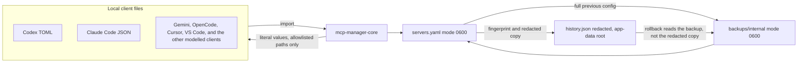
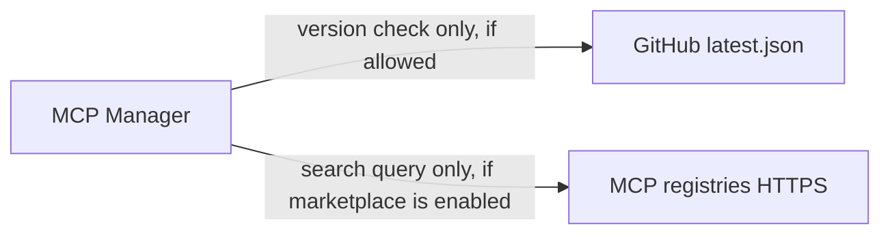

# Security architecture

MCP Manager keeps one server list and copies it into each local client's own config file. Secrets stay on the machine. They are not part of update checks or registry requests.

## Local config flow

Secrets are present in `servers.yaml`, in the internal backup, and in the client files the user asked to update. They are not present in `history.json`.

A failed multi-client apply restores the files that were already written in that attempt. A client file that another process changed after it was read is not overwritten.

## Network flow

No arrow on this diagram carries `servers.yaml`, env values, or headers. The updater endpoint is `https://github.com/xjeway/mcp-manager/releases/latest/download/latest.json`. Registries are the built-in GitHub MCP Registry, the official MCP Registry, and HTTPS registries the user adds.

## Secret capability matrix

`materialize_env` in `crates/mcp-manager-core/src/security/capabilities.rs` returns the literal value for every client. The table records what each client could accept. Adapters are not rewritten from it.

| Client | Env values | HTTP headers | OS keychain |
| --- | --- | --- | --- |
| VS Code | Reference available (`${input:id}`, sometimes `${env:NAME}`). Still written as literals. | Same. | No |
| Cursor | Literal only | Literal only | No |
| Claude Code | Literal only | Literal only | No |
| Claude Desktop | Literal only | Adapter skips MCP HTTP headers | No |
| Codex | Literal only | Literal only | No |
| OpenCode | Literal only | Literal only | No |
| GitHub Copilot | Literal only. Workspace MCP is the VS Code file. | Literal only | No |
| Gemini CLI | Literal only | Literal only | No |
| Antigravity | Literal only | Literal only | No |
| iFlow | Literal only | Literal only | No |
| Qwen Code | Literal only | Literal only | No |
| Cline | Literal only | Literal only | No |
| Windsurf | Literal only | Literal only | No |
| Kiro | Literal only | Literal only | No |
| Qoder | Literal only | Literal only | No |

Marketplace inputs marked `secret: true` are recorded on `command.secretEnv` / `CommandSpec.secret_env`. Redaction uses that set as well as key-name and value-shape checks. Adapters do not write `secret_env` into the client file.

## Filesystem rules

- New sensitive files: Unix mode `0600`. New app-data directories: group and other bits cleared, never added. A directory that was `0555` stays unwritable by the owner.
- Replacing a file copies its existing mode. Setuid and setgid are not copied. Owner and group are copied with `fchown` where the process can. POSIX ACLs beyond the mode bits are not copied. On Windows the new file starts owner-only and the previous DACL is copied when that API succeeds.
- Writes use Rust filesystem calls. The program does not shell out to `chmod`.
- Internal relative paths accept only `config/servers.yaml`.
- Client writes must match a modelled user path, or a workspace path for a client that has one, after `.` and `..` are normalised. When both paths exist, the canonical paths must also match, so a macOS `/var` path and its `/private/var` form are the same file. A symlink at or below the home directory or the workspace root is rejected. Symlinks higher up the path, such as `/var` → `/private/var`, are not.
- Backup delete and restore require a lexical path inside `backups/` and refuse a symlink at the backup file.

## Validation

`mcp-manager-core` is the authority. `workflow::apply` refuses a config with blocking issues before it writes. The CLI and the GUI both call that path. Blocking issues include an empty program, a bad server id (`/`, `\`, NUL, or a `..` segment), a URL that is not `http(s)` with a host, duplicate header names, and secret headers on non-loopback `http://`. A missing executable on `PATH` does not block apply: the user can save a server before installing its runtime.

## Limits that are intentional

- JSON with comments is parsed by stripping comments, then reserialised without those comments when the merge succeeds. A file that is still not valid JSON is left as it was.
- History fingerprints use SHA-256 from the `sha2` crate. That is identification, not encryption.
- Group and other permission bits on app-data directories are removed. Owner bits that are missing are not granted.
